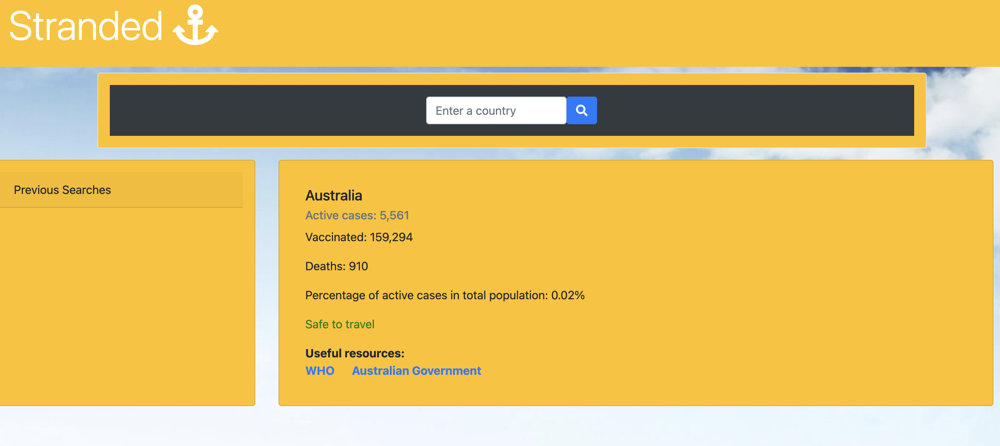
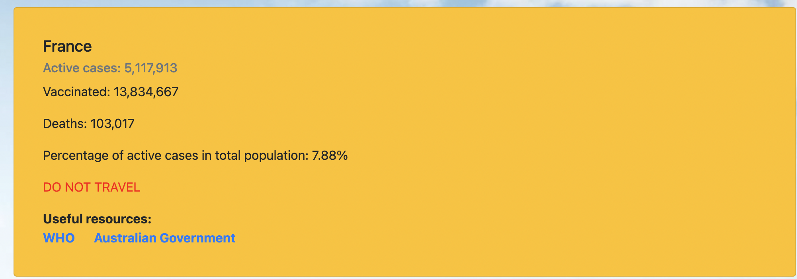
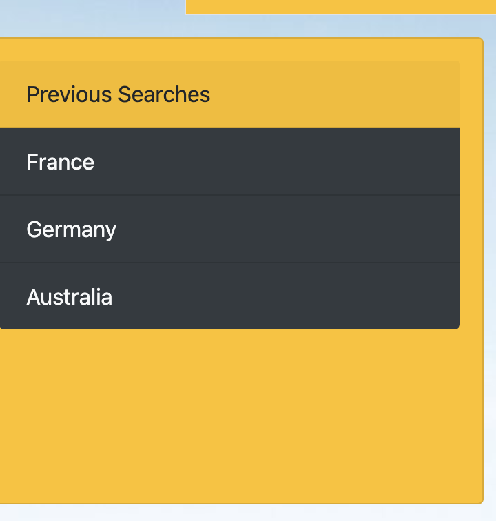

# Covid-19 Tracker

'stranded'

Description - The project's aim is to create a hassle free method for tracking Covid-19 to allow you to assess your travel options. It uses a geolocation API to track the users current location and displays the relevant covid stats when launched. It freatures current covid cases, deaths, vaccinated and a status of whether it is safe to travel. The user can then search for speicifc countries which are saved to local storage.

Technologies - This in-web browser application adopts basic CSS styling/bootstrap 4.6 to create an asthetically pleasing UI. Primary code used for this project is Javascript (avaliable to majority of web-browsers and hand held device).

- Infomation Is set/get using local storage.(client side)

- 2 API's are called to gather geographic location on page load to get you the infomation on covid in your area.

- basic Javascript logic is used to present infomation on travel recommendations ("safe to trave","DO NOT TRAVEL")

URL: https://madsterest.github.io/covid-tracking-application/

Contact me for any questions or concerns:
Email: odea.madeleine@gmail.com
